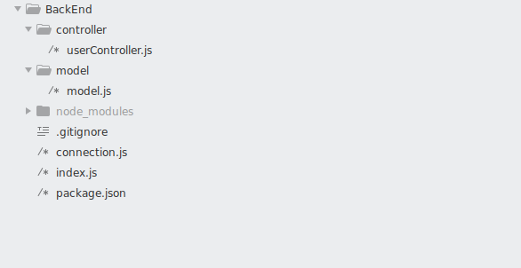
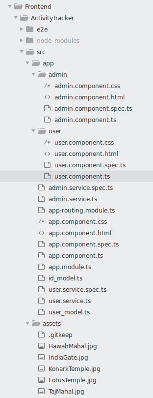

# ActivityTracker
Activity Tracker is an application running on http://localhost:4200/. This application tracks the user activities on page
http://localhost:4200/:id (where id can be any string) and displays that user activity on page http://localhost:4200/:id/admin.
Frontend part of this application is made using Angular7 and it contains 5 images.
 
 
The user activities that are tracked are -
 
 
1.Click on Image
 
2.Hover on Image
 
 
Backend server of this app is created in NodeJS and MongoDB is used to store all user activity information.
The information stored about user is -
 
 
1.ID
 
2.Type of Activity ie. Click/Hover
 
3.ImageID that was Clicked/Hovered
 
4.Timestamp of Activity.
 
 
To use the application clone the repository and go to ActivityTracker/BackEnd and open terminal and use the following command(assuming you have npm and angular7 installed if not please do that first)
 
 
npm install
 
 
and then goto ActivityTracker/FrontEnd/ActivityTracker and use the same command again.
 
 
Now start the mongoDB in your PC by using-
 
 
sudo service mongod start
 
 
or if you don't want to use local database just follow connection.js in that file instructions are given to coonnect to cloud database.
 
 

Now in ActivityTracker/BackEnd use the following command-
 
 
node index.js  
 
 
In ActivityTracker/FrontEnd/ActivityTracker use the following command-
 
 
ng serve --open
 
 
now this will open the application in your browser.

# Brief Understanding of Structure
# BackEnd
BackEnd Folder Structure
 
 

 
 
connection.js - Establish connection to mongoDB database.
 
 
model/model.js - Contain the model of the user information.
 
 
controller/userController.js - Contain the routing part of the Backend Server.Data is extracted from database and sent to Angular Server from this file and the data about user activity comes from Angular Server is saved to database from this file.
 
 
index.js - Server is created from this file.

# FrontEnd
A Part of FrontEnd Folder Structure
 
 

 
 
Components - admin , user
 
 
Services - admin.service.ts , user.service.ts
 
 
The admin and user are the components each having their own folder.
 
 
The images are displayed in user component in user.component.html.
 
 
The user activity is displayed in the admin component in admin.component.html.
 
 
Routing information is stored in the file app-routing.module.ts.
 
 
The post request is performed with the help of HttpClientModule and user.service.ts.Whenever a user activity is observed,data is sent to NodeJS server with the help of post request and then data gets save in the database and the logic for the same is written in  user.component.ts file and userController.js file(from BackEnd).
 
 
The post request is performed with the help of HttpClientModule and admin.service.ts.The id of user is sent to NodeJS server with the help of post request and the response that comes from post request contain the data that is required to display and the logic for the same is written in admin.comonent.ts file and userController.js file(from BackEnd).
 
 
assets - This folder contain the images which are to be displayed.

